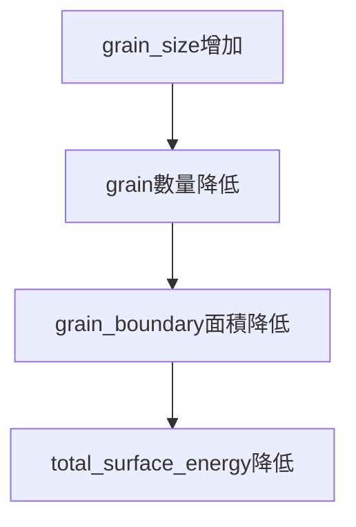

- driving force : reduction fo the surface energy of grain boundary

- Gibb-Thompson equation : pressure difference
- ![[Pasted image 20230615221409.png]]

- 直徑越小 ，the greater the excess pressure inside the bubble

![[Pasted image 20230615221506.png]]

- curvature 大 ，壓力差大 ， wall migration 增加

- 少於六個邊的 : concave
- 多於六的邊的 : convex ![[Pasted image 20230615221627.png]]
- 邊的數量會改變during grain growth

## 8.21 Geometrical Coalescence : 2D
![[Pasted image 20230615221817.png]]

![[Pasted image 20230615221759.png]]

- 隨機orientation 不太會coalescence
- highly textured 大機率coalescence

## 8.22 Three dimensional changeds in grain gromety

## 8.23 The grain growth Law

- 仍然沒有被完全同意

---

- 假設rate of growth of the cells 正比於 curvature
![[Pasted image 20230615222105.png]]

![[Pasted image 20230615222121.png]]![[Pasted image 20230615222128.png]]

- grnerally accepted : 曲率越大 , boundary 移動越大

## Grain growth factors
1. impurity 
2. second phase
3. free surface effects
4. preferred orientation

## 8.24 Impurity atoms in solid solution

- impurity 越多, grain growth 越慢
- ![[Pasted image 20230615222433.png]]
- 不同atom造成的影響也不同

## 8.25 Impurities in the Form of Inclusion

![[Pasted image 20230615222625.png]]

- inhibit grain growth
![[Pasted image 20230615224929.png]]
![[Pasted image 20230615225620.png]]
## 8.26 The Free-Surface Effects
- reducing the net curvature
![[Pasted image 20230615225957.png]]

![[Pasted image 20230615225628.png]]

## abnormal
## secondary recrystallization
![[Pasted image 20230615232916.png]]
![[Pasted image 20230615232900.png]]
![[Pasted image 20230615232909.png]]
## strain - induced
![[Pasted image 20230615232650.png]]

![[Pasted image 20230615232700.png]]

![[Pasted image 20230615232644.png]]