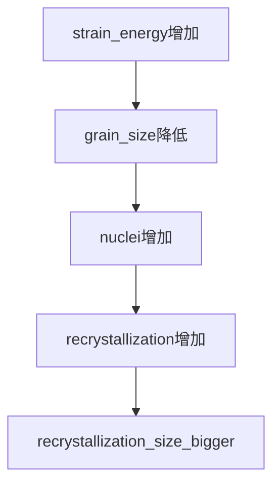
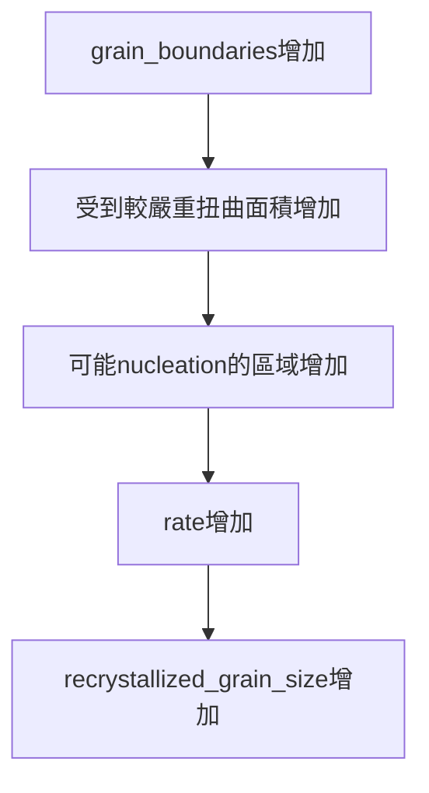

## 8.9 Recrystallization (第二階段)

- kinectics of 再結晶 : 
	- nucleation
	- growth

- recovery 和 recrystallization 都是driven by the stored energy 
	- 都是必須的for 
		- nucleation of recrystallized grains

- recrystallization : 
	- deformed grains are replaced by a new set of undeformed grains
	- and grow until the original grains have been entirely consumed
	- (用undefromed grain去替換原本的直到原本的被完全取代)

- Mechanical properties 變化最大 (hardness)
	- softening

## 8.10 Recrystallization 溫度和時間影響

![[Pasted image 20230615210851.png]]
- 溫度越高，時間越短 (快)

![[Pasted image 20230615211118.png]]

- $Q_R$ : activation energy for recrystallization : 一直在變化 --> 很複雜
- 不只一個process ，$Q_R$ 無法被輕易找出

- 最亂的地方 (提供能量\mobility) --> 預測recrystalliztion的地方

## 8.11 Recrystalliztion Temperature

![[Pasted image 20230615211458.png]]

- 假設$Q_R$固定 : 
	- 590K : 2hr
	- 600K : 1hr
	- 610K : 30min
	- 620K : 15min

- 導致會有一個 fixed temp , 低於它就無法recrystallize

## 8.12 重要 The effect of Strain on Recrystallization

![[Pasted image 20230615212414.png]]

- recrystallization 速度取決於 : 一開始deform的程度
> 也就是 cold work 越多 , 再結晶越快

- $Q_R$ 依舊複雜 : 和deform程度也相關
- ![[Pasted image 20230615212657.png]]

## 8.13 Nucleation and Nucleue Growth 的速度

- 1/τ = Ae(-$Q_R$/RT)
- 成核速度和成長速度會影響最終grain size
- 如果成核快，成長慢 : small grain
- 相反 : big grain

- N : the rate of nucleation
- G : the rate of growth
- N > G : 很多小的
- N < G : 很多大的

## 8.14 Formation of Nuclei

- in recrystallization : an entirely new set of grains is fromed
- new crystal 出現在 high lattice strain energy (disl多的地方)
- 這種出現在嚴重defromed的成核 : 稱之 " preformed nuclei "

- 理論 : (大多同意的兩點)
	1. its size exceeds some minimum value
	2. nucleus 被 high angle grain bd包圍

- 除了上面兩點 ， models vary a lot

### bulge
![[Pasted image 20230615213838.png]]
- one typical nucleation model for polycrystals : bulge
1. creating a small , strain-free volume
2. driving force : strain energy reduction

- 能量越高 --> 產生nuclei (提供成長動力)
- Energy 高 --> GB or 扭曲大的空間

- other mechanisme for forming single crystal
	- 當兩個low angle , 有一個subgrain rotation --> 合併成一個

## 8.15 Driving force for Recrystallization

- stored energy of cold work
- polygonization is completed befor recrystallization

- the elimination of the subboundaries is a basic part of the recrystallization process (消除掉sub boundary)

## 8.16 Recrystallized Grain Size 

- smaller amounts of deformation --> large grain diameter
	- 利用recrystallization 控制grain size
- orange peeling condition : surface defect : 不均勻deformation

(polycrystal : grain越小越好 --> 均勻 (isotropic))

![[Pasted image 20230615214635.png]]

- grain size 不受溫度影響
- 受cold work 影響 (deform 程度) 
- cold work 增加 
- --> grain size 降低 
- --> recrystallized grain size 增加 (not much)
- --> recrystallized rate 增加
- grain size control after primary deformation

![[Pasted image 20230615214828.png]]

- 有臨界值，超過這個deformation 才會有recrystallization

- FCC : surface energy depend on packing density
- 密度越高的面 ， surface energy越低
---

![[Pasted image 20230615215052.png]]

### summary

## 8.17 Other Variables in Recrystallization

- factors
	1. 溫度 --> 不影響grain size
	2. deformation程度
	3. purity
	4. inital grain size

## 8.18 Purity of the Metal

- purity 增加 --> recrystallization rate 增加
- 圖上寫錯，應為impurity![[Pasted image 20230615220045.png]]

- 有邊際效應

- 因為有外來atom ，所以inhibit subgrain coalescence , lower the recrystallization rate
- elastic field (boundary) 也被lowered

## 8.19 Initial Grain Size
- cold worked , grain boundaries 相當於阻止slip process
- 所以，在gb旁邊受到的扭曲比較大

![[Pasted image 20230615220815.png]]

## Summery

- grain size 不受溫度影響 ，受deform 程度影響
- cold work 越多 , 再結晶越快
- driving force : stored energy of cold work
- 成核會在扭曲大地方生成
- grain boundary 扭曲大